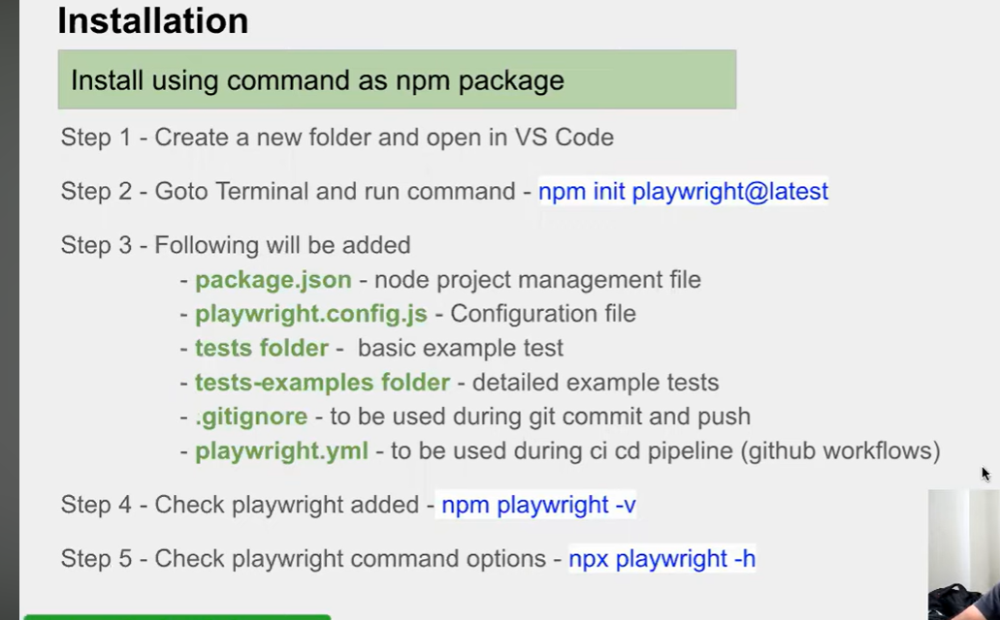
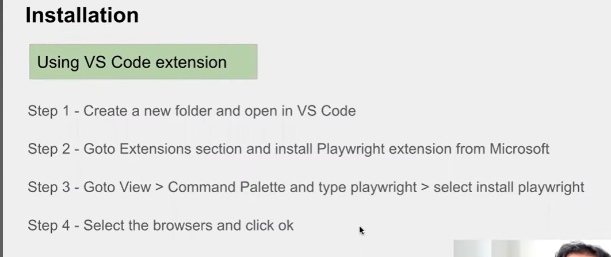

## Installation

* Install using command as npm package
  * Create a new folder and open in VS Code
  * GoTo Terminal and run command - `npm init playwright@latest`


Offical Website - https://playwright.dev

https://github.com/microsoft/playwright


```txt
Inside that directory, you can run several commands:

  npx playwright test
    Runs the end-to-end tests.

  npx playwright test --ui
    Starts the interactive UI mode.

  npx playwright test --project=chromium
    Runs the tests only on Desktop Chrome.

  npx playwright test example
    Runs the tests in a specific file.

  npx playwright test --debug
    Runs the tests in debug mode.

  npx playwright codegen
    Auto generate tests with Codegen.

We suggest that you begin by typing:

    npx playwright test

And check out the following files:
  - .\tests\example.spec.js - Example end-to-end test
  - .\playwright.config.js - Playwright Test configuration

Visit https://playwright.dev/docs/intro for more information. ✨

Happy hacking! 🎭
```



## Installation using VS code Extension

